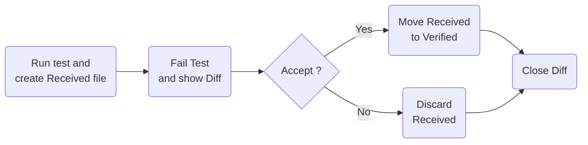
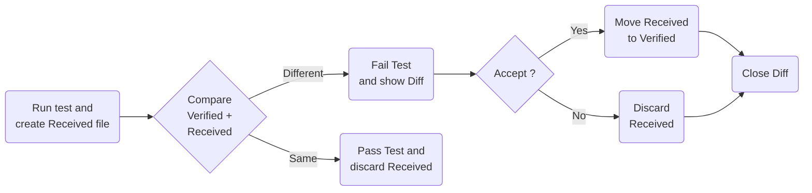

# Assumed knowledge

 * unit testing
 * asserts

At any time ask questions

# Snapshot Flow

## First run

No existing `.verified.` file.

## Subsequent run

Existing `.verified.` file.

# Snapshot management

* Choose a [DiffTool](https://github.com/VerifyTests/DiffEngine#supported-tools). 

* [DiffEngineTray](https://github.com/VerifyTests/DiffEngine/blob/main/docs/tray.md) (Windows only), or [Rider/R# extension](https://github.com/matkoch/resharper-verify), or [via Clipboard](https://github.com/VerifyTests/Verify/blob/main/docs/clipboard.md)

 * Demo WinFormsAppTests from scratch
 * Nested files in IDE
 * Add `*.received.*` to [.gitignore](https://github.com/VerifyTests/Verify.Sample/blob/main/.gitignore#L8)

# Snapshot is Serialization

Snapshot testing leverages serialization. Converting a UI to an image is a form of serialization. The same serialization approach can be applied to any data.

 * Demo: Convert `PersonBuilderTests.cs` to snapshot testing
 * Scrubbers:
 * Demo: Sql Schema. 

# Global Scrubbers

 * Demo Blazor

# Converters

Above samples WinForms and Sql were implemented as converters, but only output one file.

Converters can output multiple files. See `BrowserTest.cs`

# Parameterized Testing

 * file naming
 * Demo: ParamTests

# Recording

 * Demo [Sql recording](https://github.com/VerifyTests/Verify.SqlServer#recording)
 * Demo [Http recording](https://github.com/VerifyTests/Verify.http)

# Comparers

 * WinForms
 * Xaml
 * Web

## Demo: 