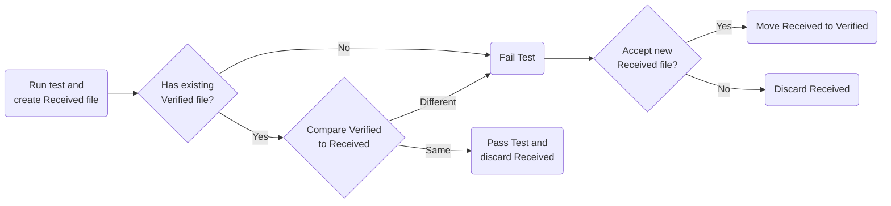

# Assumed knowledge

 * unit testing
 * asserts

At any time ask questions

# Traditional Snapshot

 * install DiffEngineTray
   dotnet tool install --global DiffEngineTray --version 6.9.1
 * install a DiffTool
 * Demo WinFormsAppTests from scratch
 * Nested files
 * ignore received

# Snapshot is Serialization

Snapshot testing leverage serialization. Converting a UI to an image is a form of serialization. The same serialization approach can be applied to any data.

 * Demo: Convert PersonBuilderTests.cs to snapshot testing
 * Scrubbers:
 * Demo: Sql Schema, Anything can be serialized

# Global Scrubbers

 * Demo Blazor

# Converters

Above samples Winforms and Sql were implemented as converters, but only output one file.

Converters can output multiple files

# Parameterised Testing

 * file naming
 * Demo: ParamTests

# Recording

 * Demo Sql recording
 * Demo Http recording

# Comparers

 * Winforms
 * Xaml
 * Web 

## Demo: 